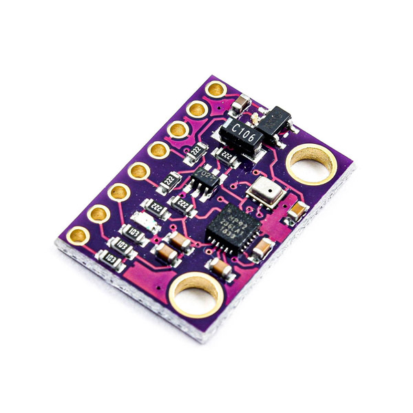
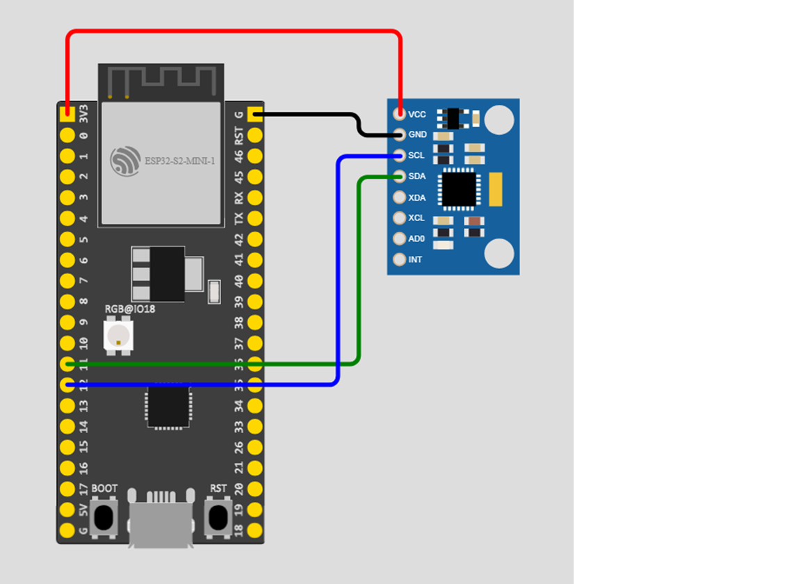

# HƯỚNG DẪN SỬ DỤNG MODULE GY-91 VỚI ESP32 S2 MINI

GY-91 là một mạch cảm biến đo lường quán tính 10 bậc tự do (DoF) (IMU). Cảm biến này chứa một gia tốc kế và con quay hồi chuyển trong chip MPU6050, một từ kế trong chip AK8963 và cảm biến độ cao (áp suất khí quyển, nhiệt độ) trong chip BMP280.

Mạch cho phép người dùng đo gia tốc, con quay, độ nghiêng từ tính, độ cao và nhiệt độ, tất cả đều bằng giao tiếp I2C.
## Mua hàng
 - Link mua hàng: [Shopee](https://shopee.vn/Chip-ca%CC%89m-bi%C3%AA%CC%81n-MPU9250-BMP280-GY-91-10DOF-gia-t%C3%B4%CC%81c-con-quay-h%C3%B4%CC%80i-chuy%C3%AA%CC%89n-9-tru%CC%A3c-i.148048328.7320066383), [Thegioiic](https://www.thegioiic.com/gy-91-mpu9250-bmp280-mach-cam-bien-con-quay-gia-toc-tu-truong)

 - Giá: 120.000đ - 200.000đ

## Cấu hình phần cứng hệ nhúng
#### ESP32 S2 Mini
  - Điện áp làm việc: 3.3VDC
  - Số cổng I/O: 27
  - Tần số hoạt động: 240Mhz
  - Bộ nhớ Flash: 4MB
  - Vi xử lý chính: ESP32-S2FN4R2 WIFI
  - TYPE C - USB
  - Giao tiếp: ADC, DAC, I2C, SPI, UART, USB OTG

#### GY-91 MPU9250 + BMP280
  Thông số kỹ thuật:
  - Gia tốc kế 3 trục (MPU6050):
    - ± 2g, ± 4g, ± 8g và ± 16g với ADC 16-bit
    - Tốc độ lấy mẫu: 4000Hz
  - Con quay hồi chuyển 3 trục (MPU6050):
    -  ± 250, ± 500, ± 1000 và ± 2000 °/giây với ADC 16 bit
    - Tốc độ lấy mẫu tối đa: 8000Hz
  - Từ trường 3 trục (AK8963):
    - ± 4800µT với ADC 14 bit
    - Tốc độ lấy mẫu: 8Hz
  - Bộ chuyển đổi nhiệt độ và áp suất (BMP280):
    - Phạm vi nhiệt độ: -40 ~ 85 ° C với 16-20 bit ADC
    - Dải áp suất: 300-1100 hPa với ADC 16-20 bit
    - Tốc độ lấy mẫu: 150Hz
  - Giao tiếp I2C. Tương thích với Arduino và Raspberry Pi
## Cấu hình trên Arduino
- Cài đặt thư viện [MPU9250_asukiaaa](https://github.com/asukiaaa/MPU9250_asukiaaa)
- Sơ đồ mạch:

- Cấu hình:

|ESP32        |GY-91        |
| ----------- | ----------- |
|3V3          |3V3          |
|GND          |GND          |
|11           |SDA          |
|12           |SCL          |

## Vấn đề
- Không đọc được giá trị của từ kế (Magnetometer) dù đã thử qua nhiều thư viện MPU9250 khác nhau.
## Tác giả
- Email: ndhuy3000ride@gmail.com
- Thư viện MPU9250: [MPU9250_asukiaaa](https://github.com/asukiaaa/MPU9250_asukiaaa)